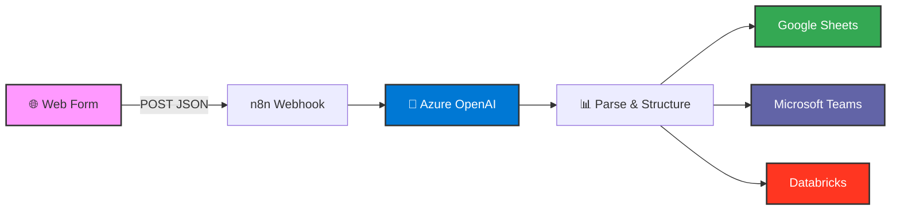

<div align="center">

# 📝 Customer Visit Notes Portal

**Husqvarna Group** internal portal for documenting customer visit notes with AI-powered translation and multi-platform distribution.

[](https://hsq-emilkarlsson.github.io/hsq-delaervisitnotes/login.html)
[]()

</div>

---

## ✨ Features

<table>
<tr>
<td width="50%">

### 🔐 **Secure Authentication**
- SHA-256 token hashing
- Session management (24h expiry)
- No backend required

### 🤖 **AI Translation**
- Azure OpenAI (GPT-4o-mini)
- Automatic English translation
- Preserves original content intent
- Structured output (summary, bullets, action items)

</td>
<td width="50%">

### 📊 **Multi-Platform Distribution**
- **Google Sheets** - Structured data storage
- **Microsoft Teams** - Team notifications
- **Databricks** - Analytics lakehouse

### 🎨 **Branded UI**
- Minimalist Swiss-style design
- Husqvarna Group branding
- Responsive mobile-ready layout

</td>
</tr>
</table>

---

## 🚀 Tech Stack

<div align="center">


</div>

---

## 🔄 Workflow



---

## 📖 Usage

1. **Access Portal**: [hsq-emilkarlsson.github.io/hsq-delaervisitnotes/login.html](https://hsq-emilkarlsson.github.io/hsq-delaervisitnotes/login.html)
2. **Authenticate**: Enter your access token
3. **Fill Form**: Document meeting details and notes (any language)
4. **Submit**: Data automatically translated, structured, and distributed

---

## 🔐 Access

This portal requires an access token. Contact **[emil.karlsson@husqvarnagroup.com](mailto:emil.karlsson@husqvarnagroup.com)** for access.

---

## 🏗️ Architecture

- **Frontend**: Pure HTML/CSS/JS (no build step)
- **Authentication**: Client-side SHA-256 token hashing
- **Hosting**: GitHub Pages (static)
- **Backend**: n8n workflow automation
- **AI**: Azure OpenAI GPT-4o-mini (temp: 0.2)
- **Storage**: Google Sheets, Databricks Delta Lake

---

## 📝 Data Flow

| Stage | Technology | Purpose |
|-------|-----------|---------|
| **Input** | HTML Form | User enters meeting notes |
| **Auth** | SHA-256 + sessionStorage | Secure token validation |
| **Transport** | Fetch API (JSON) | POST to n8n webhook |
| **Translation** | Azure OpenAI | English translation + structuring |
| **Parse** | n8n Code Node | Extract fields & format |
| **Storage** | Google Sheets API | Append row with structured data |
| **Notification** | Power Automate → Teams | Post formatted message |
| **Analytics** | Databricks SQL API | INSERT into Delta table |

---

## 🎯 For Developers

### Local Development

```bash
# Serve locally
python3 -m http.server 8000

# Access at
open http://localhost:8000/login.html
```

### Project Structure

```
.
├── login.html          # Authentication page
├── form.html           # Main form interface
├── README.md           # This file
├── .gitignore          # Excludes sensitive files
└── (excluded from repo)
    ├── n8n.json               # Workflow definition
    ├── DATABRICKS_SETUP.md    # Setup guide
    └── generate-token.html    # Token generator
```

---

<div align="center">

**Internal Prototype Environment** | Husqvarna Group Data & Analytics Team

*For production access inquiries, contact the Data & Analytics team.*

</div>
